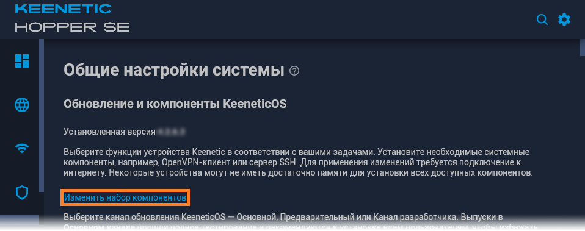
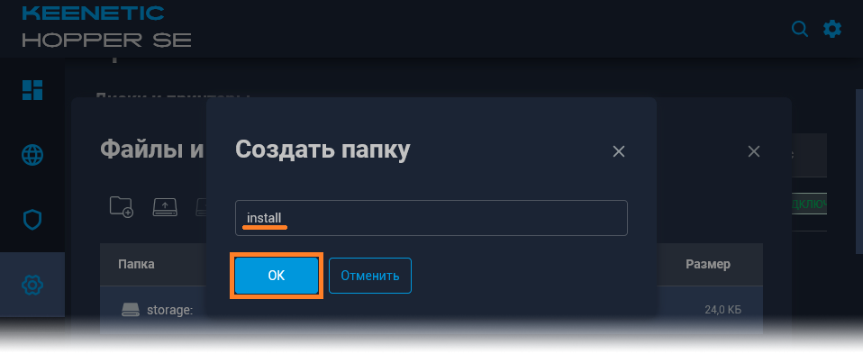
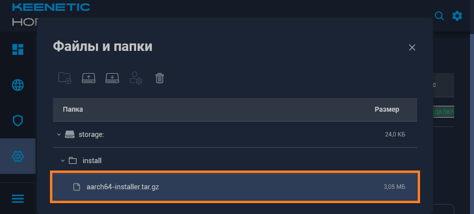
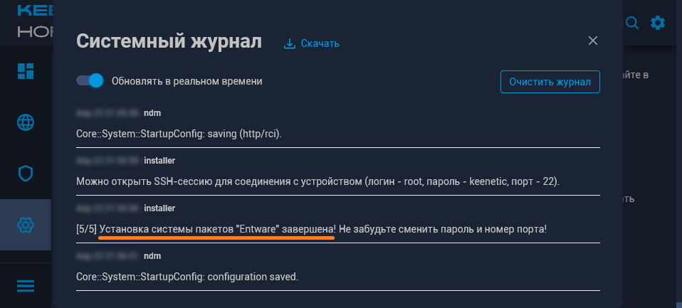
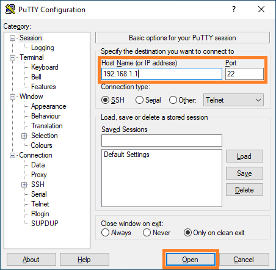
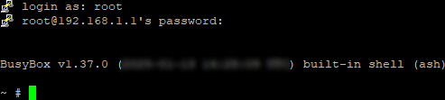
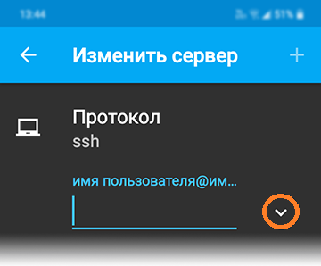
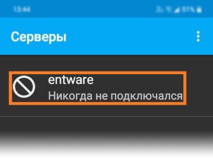

# IPSh - [IPSpeed.info](https://ipspeed.info) helper
Небольшой скрипт, призванный помочь и максимально упростить работу с ipspeed.info...

## Установка.
<details><summary>Для тех, кто начинает с самого начала (установка Entware)</summary>
▪ Нам понадобится маршрутизатор Keenetic (или ZyXel Keenetic) с USB-портом(ами) поддерживающий работу с накопителями.

> К таковым не относятся устройства: 4G II, 4G III, а также - бюджетные модели 2024-го года (уточняйте поддержку соответствующих функций на сайте производителя).

<details><summary>Если у вас ZyXel Keenetic (с KeeneticOS версии 2.x)...</summary>
▪ Открываем (в веб-конфигураторе) интерфейс командной строки, обычно это:
 
```
http://192.168.1.1/a
```

И вводим в поле "Command" одну из следующих команд:

```
components sync legacy
```

> (для KeeneticOS до версии 2.06)

```
components list legacy
```
> (для KeeneticOS версии 2.06 и выше)

▪ Нажимаем кнопку "Отправить запрос".

▪ Затем, переходим в "Управление/Параметры системы", проверяем наличие обновлений KeeneticOS, и если таковые есть - устанавливаем их...
</details>

▪ (В веб-конфигураторе) переходим в "Управление/Параметры системы", нажимаем "Изменить набор компонентов"...

<details><summary>(показать скриншот)</summary>

</details>

▪ Устанавливаем/убеждаемся что установлен следующий компонент:

```
Поддержка открытых пакетов
```

<details><summary>(показать скриншот)</summary>

</details>

> Чтобы упростить поиск нужных компонентов в списке - можно воспользоваться полем "Поиск" (Поиск компонентов по имени)...

> Если компонент не был установлен - в процессе его устаноовки, интернет-центр будет перезагружен...

▪ Теперь нужно определиться - где будет установлен Entware: во встроенном хранилище или на USB-накопителе…
- Встроенное хранилище - всегда с интернет-центром, не отключится (по каким-то своим причинам), не занимает USB-порт. Но - имеет существенные ограничения по объёму, и (теоретически) чувствительно к постоянной перезаписи данных (флеш-память имеет свойство изнашиваться, в связи с чем - крайне рекомендуется (по возможности) избегать ведение логов (с сохранением данных на встроенное хранилище))...
- USB-накопитель - может существенно привышать встроенное хранилище по объёму, может быть легко заменён (в случае каких-либо проблем). Но - занимает USB-порт, может быть медленнее встроенного хранилища (в зависимости от типа интерфейса/накопителя), может неожиданно оказаться отключеным (из за перегрева, механического воздействия или каких-то других причин)...
> USB-накопитель - желательно отформатировать в ext4 ( под Windows, это можно сделать с помощью бесплатной версии [AOMEI Partition Assistant](https://www.aomeitech.com/pa/standard.html) и обязательно следует задать ему какую-нибудь метку тома...

▪ Скачиваем дистрибутив Entware (подходящий для архитектуры процессора вашего маршрутизатора):
- [mipsel](https://bin.entware.net/mipselsf-k3.4/installer/mipsel-installer.tar.gz)
- [mips](https://bin.entware.net/mipssf-k3.4/installer/mips-installer.tar.gz)
- [aarch64](https://bin.entware.net/aarch64-k3.10/installer/aarch64-installer.tar.gz)

> Определить, архитектуру вашего устройства - не так просто, как хотелось бы...

▪ Открываем интерфейс командной строки (обычно это):

```
http://192.168.1.1/a
```

▪ Вводим следующую команду:

```
show version
```

▪ Нажимаем кнопку "Отправить запрос"...

<details><summary>(показать скриншот)</summary>

</details>

В отчёте (об установленной версии KeeneticOS) – будет строка: "arch": "*****" (где ***** - указание на архитектуру процессора). Если архитектура: aarch64 - можно смело качать и устанавливать соответствующий дистрибутив Entware. Если: mips - придётся воспользоваться интернетом для уточнения: mips или mipsel...

<details><summary>(показать скриншот)</summary>

</details>

> Если у вас актуальная модель маршрутизатора – соответствие архитектуры конкретным устройствам можно посмотреть [здесь]( https://help.keenetic.ru/hc/ru/articles/360021214160.html).

▪ Переходим в "Управление/Приложения" (в веб-конфигураторе)...

<details><summary>(показать скриншот)</summary>

</details>

▪ В разделе "Диски и принтеры" - открываем накопитель (который будет использоваться для размещения Entware)...

<details><summary>(показать скриншот)</summary>

</details>

▪ Создаём в корне диска папку "install" (все буквы в имени - должны быть строчными)...

<details><summary>(показать скриншот)</summary>

</details>

▪ Помещаем в неё скачанный архив (с дистрибутивом Entware)...

<details><summary>(показать скриншот)</summary>


</details>

▪ Затем, переходим в "Управление/OPKG" и в меню "Накопитель" - выбираем диск с дистрибутивом Entware, и нажимаем "Сохранить"...

<details><summary>(показать скриншот)</summary>

</details>

> Дожидаемся, когда побледневшая кнопка "Сохранить" полностью исчезнет…

▪ Переходим в "Управление/Диагностика", где нажимаем "Показать журнал".

<details><summary>(показать скриншот)</summary>

</details>

▪ В журнале (одно за другим) будут появляться события (связанные с установкой и настройкой различных компонентов Entware), мы ждём события "Установка системы пакетов Entware - завершена"...

<details><summary>(показать скриншот)</summary>

</details>

<details><summary>Теперь нам понадобится ПК и PuTTY</summary>
 
▪ [Скачиваем](http://www.putty.org/), устанавливаем и запускаем PuTTY...


▪ В поле "Host Name (or IP adress)" - вводим IP-адрес вашего маршрутизатора, обычно это:

```
192.168.1.1
```

▪ В поле "Port" - оставляем:

```
22
```

> (или вводим "222", если до установки Entware в прошивке уже был установлен компонент "Сервер SSH")

<details><summary>(показать скриншот)</summary>

</details>

▪ Нажимаем кнопку "Open"...

> (При первом подключении) появится окошко с предупреждением - в котором нужно нажать "Accept".

<details><summary>(показать скриншот)</summary>

</details>
 
▪ Откроется окно терминала. На запрос имени пользователя (login as) вводим:

```
root
```

▪ Нажимаем ввод...

▪ На запрос пароля (root@192.168.1.1's password) - вводим:

```
keenetic
```

<details><summary>(показать скриншот)</summary>

</details>

> (при вводе пароля - символы отображаться не будут).

> Если у вас возникают сложности с вводом пароля - его можно скопировать из блокнота (или из этой инструкции) и вставить в окно терминала  (кликом правой кнопки мыши)...

▪ Если всё правильно - появится приглашение для ввода команд...

``
~ #
``
<details><summary>(показать скриншот)</summary>

</details>
</details>

<details><summary>Если ПК под рукой нет (но есть смартфон)...</summary>
▪ Устанавливаем ConnectBot из [GooglePlay](https://play.google.com/store/apps/details?id=org.connectbot) или [RuStore](https://www.rustore.ru/catalog/app/org.connectbot) и открываем его...

▪ Нажимаем кнопку "+" (в нижней части экрана)...

<details><summary>(показать скриншот)</summary>

</details>

▪ Нажимаем на направленную вниз галку (справа от поля)...

<details><summary>(показать скриншот)</summary>

</details>

▪ Заполняем поля "Имя пользователя", "Сервер" и "Порт" - следующими данными:

Имя пользователя:

```
root
```

Сервер - адрес вашего интернет-центра (обычно это):
```
192.168.1.1
```

Порт:

```
22
```

> (или вводим "222", если до установки Entware в прошивке уже был установлен компонент "Сервер SSH")

<details><summary>(показать скриншот)</summary>

</details>

▪ Нажимаем кнопку "Назад"...

▪ Возвращаемся к списку серверов и выбираем (добавленное) подключение...

<details><summary>(показать скриншшот)</summary>

</details>

▪ Соглашаемся "продолжить попытки соединений"...

<details><summary>(показать скриншот)</summary>

</details>

▪ Вводим пароль:

```
keenetic
```

<details><summary>(показать скриншот)</summary>

</details>

▪ Нажимаем ввод...

▪ Если всё правильно - появится приглашение для ввода команд...

``
 ~ #
 ``

<details><summary>(показать скриншот)</summary>

</details>
</details>
</details>

<details><summary>Чтобы всё правильно работало (необходимые компоненты)</summary>
Понадобится следующий компонент:

```
Клиент SSTP VPN
```

<details><summary>(показать скриншот)</summary>

</details>

> Чтобы упростить поиск нужных компонентов в списке - можно воспользоваться полем "Поиск" (Поиск компонентов по имени.) Достаточно ввести несколько букв (названия компонента)...

Устанавливаем недостающий компонент, перезагружаемся и проверяем (все ли необходимые компоненты - установились)...

> Если уже установлено слишком много компонентов - новым может просто не хватать свободного места. В этом случае, придётся отключить какие-нибудь неиспользуемые компоненты...
</details>

Для того чтобы начать пользоваться IPSh - достаточно скопировать и вставить в терминал, следующие несколько команд:

```
opkg update
opkg install ca-certificates wget-ssl
opkg remove wget-nossl
wget -q -O /opt/bin/ipsh https://raw.githubusercontent.com/Neytrino-OnLine/ipsh/refs/heads/main/ipsh.sh
chmod +x /opt/bin/ipsh

```

> Вставить их в PiTTY можно - кликом правой кнопки мыши (по окну терминала), В ConnectBot - можно использовать кнопку "Вставить" (на верхней панели)...

По завершению процесса - вводим в терминал:

```
ipsh
```

И нажимаем "ввод"...


