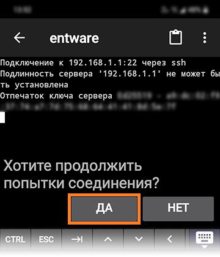

# IPSh - [IPSpeed.info](https://ipspeed.info) helper
Небольшой скрипт, призванный помочь и максимально упростить работу с ipspeed.info...

## Установка.
<details><summary>Для тех, кто начинает с самого начала (установка Entware)</summary>
Нам понадобится маршрутизатор Keenetic (или ZyXel Keenetic) с USB-портом(ами) поддерживающий работу с накопителями.

> К таковым не относятся устройства: 4G II, 4G III, а также - бюджетные модели 2024-го года (уточняйте поддержку соответствующих функций на сайте производителя).

<details><summary>Если у вас ZyXel Keenetic (с KeeneticOS версии 2.x)...</summary>
Открываем (в веб-конфигураторе) интерфейс командной строки, обычно это:
 
````
http://192.168.1.1/a
````
И вводим в поле "Command" одну из следующих команд:

````
components sync legacy
````
> (для KeeneticOS до версии 2.06)
````
components list legacy
````
> (для KeeneticOS версии 2.06 и выше)

Нажимаем кнопку "Отправить запрос".

Затем, переходим в "Управление/Параметры системы", проверяем наличие обновлений KeeneticOS, и если таковые есть - устанавливаем их...
</details>

<details><summary>(В веб-конфигураторе) переходим в "Управление/Параметры системы", нажимаем "Изменить набор компонентов" и устанавливаем/убеждаемся что установлен следующий компонент:</summary>

 
 </details>

```
Поддержка открытых пакетов
```
> Чтобы упростить поиск нужных компонентов в списке - можно воспользоваться полем "Поиск" (Поиск компонентов по имени)...
> Если компонент не был установлен - в процессе его устаноовки, интернет-центр будет перезагружен...

▪ Теперь нужно определиться - где будет установлен Entware: во встроенном хранилище или на USB-накопителе…
- Встроенное хранилище - всегда с интернет-центром, не отключится (по каким-то своим причинам), не занимает USB-порт. Но - имеет существенные ограничения по объёму, и (теоритически) чувствительно к постоянной перезаписи данных (флеш-память имеет свойство изнашиваться, в связи с чем - крайне рекомендуется (по возможности) избегать ведение логов (с сохранением данных на встроенное хранилище))...
- USB-накопитель - может существенно привышать встроенное хранилище по объёму, может быть легко заменён (в случае каких-либо проблем). Но - занимает USB-порт, может быть медленнее встроенного хранилища (в зависимости от типа интерфейса/накопителя), может неожиданно оказаться отключеным (из за перегрева, механического воздействия или каких-то других причин)...
> USB-накопитель - желательно отформатировать в ext4 ( под Windows, это можно сделать с помощью бесплатной версии [AOMEI Partition Assistant](https://www.aomeitech.com/pa/standard.html) и обязательно следует задать ему какую-нибудь метку тома...

▪ Скачиваем дистрибутив Entware (подходящий для архитектуры процессора вашего маршрутизатора):
- [mipsel](https://bin.entware.net/mipselsf-k3.4/installer/mipsel-installer.tar.gz)
- [mips](https://bin.entware.net/mipssf-k3.4/installer/mips-installer.tar.gz)
- [aarch64](https://bin.entware.net/aarch64-k3.10/installer/aarch64-installer.tar.gz)

▪ Определить, архитектуру вашего устройства - не так просто, как хотелось бы... Открываем интерфейс командной строки (обычно это):

```
http://192.168.1.1/a
```
<details><summary>Вводим следующую команду, и нажимаем кнопку "Отправить запрос":</summary>


</details>

```
show version
```
В отчёте (об установленной версии KeeneticOS) – будет строка: "arch": "*****" (где ***** - указание на архитектуру процессора). Если архитектура: aarch64 - можно смело качать и устанавливать соответствующий дистрибутив Entware. Если: mips - придётся воспользоваться интернетом для уточнения: mips или mipsel...
> Если у вас актуальная модель маршрутизатора – соответствие архитектуры конкретным устройствам можно посмотреть [здесь]( https://help.keenetic.ru/hc/ru/articles/360021214160.html).

Переходим в "Управление/Приложения" (в веб-конфигураторе), в разделе "Диски и принтеры" - открываем накопитель (который будет использоваться для размещения Entware), создаём в корне диска папку "install" (с маленькой буквы) - помещаем в неё скачанный архив с дистрибутивом Entware.

Затем, переходим в "Управление/OPKG" и в меню "Накопитель" - выбираем диск с дистрибутивом Entware, нажимаем "Сохранить".
> Дожидаемся, когда побледневшая кнопка "Сохранить" полностью исчезнет…

Переходим в "Управление/Диагностика", где нажимаем "Показать журнал". В журнале (одно за другим) будут появляться события (об устанавке различных модулей и компонентов Entware), мы ждём события "Установка системы пакетов Entware - завершена".

<details><summary>Теперь нам понадобится ПК и PuTTY</summary>
 
▪ [Скачиваем](http://www.putty.org/), устанавливаем и запускаем PuTTY...

<details><summary>В поле "Host Name (or IP adress)" - вводим IP-адрес вашего маршрутизатора, обычно это:</summary>

</details>

```
192.168.1.1
```

В поле "Port" - оставляем:

```
22
```
> (или вводим "222", если до установки Entware в прошивке уже был установлен компонент "Сервер SSH")

И нажимаем кнопку "Open"...

<details><summary>(При первом подключении) появится окошко с предупреждением - в котором нужно нажать "Accept".</summary>

</details>
 
<details><summary>Откроется окно терминала...</summary>

</details>

На запрос имени пользователя (login as) вводим:

```
root
```
Нажимаем ввод, а на запрос пароля (root@192.168.1.1's password):

```
keenetic
````
> (при вводе пароля - символы отображаться не будут).

> Если у вас возникают сложности с вводом пароля - его можно скопировать из блокнота (или из этой инструкции) и вставить в окно терминала  (кликом правой кнопки мыши)...

<details><summary>Если всё правильно - появится приглашение для ввода команд: "~ #"...</summary>

</details>
</details>
<details><summary>Если ПК под рукой нет (но есть смартфон)...</summary>
▪ Устанавливаем ConnectBot [GooglePlay](https://play.google.com/store/apps/details?id=org.connectbot)/[RuStore](https://www.rustore.ru/catalog/app/org.connectbot) и открываем его...

<details><summary>Нажимаем кнопку "+" (в нижней части экрана)...</summary>

</details>

<details><summary>Нажимаем на направленную вниз галку (справа от поля)</summary>

</details>

<details><summary>Заполняем поля "Имя пользователя", "Сервер" и "Порт" - следующими данными:</summary>

</details>

Имя пользователя:

```
root
```

Сервер:
```
192.168.1.1
```

Порт:

```
22
```

> (или вводим "222", если до установки Entware в прошивке уже был установлен компонент "Сервер SSH")

И нажимаем кнопку "Назад"...

<details><summary>Возвращаемся к списку серверов и выбираем (добавленный) сервер...</summary>

</details>

<details><summary>Соглашаемся продолжить попытки соединений...</summary>

</details>

<details><summary>Вводим пароль:</summary>

</details>

```
keenetic
```

И нажимаем ввод...

<details><summary>Если всё правильно - появится приглашение для ввода команд: "~ #"...</summary>

</details>
</details>
</details>

<details><summary>Чтобы всё правильно работало (компоненты и настройки)</summary>
Понадобятся следующие компоненты:

 - Клиент SSTP VPN

> Чтобы упростить поиск нужных компонентов в списке - можно воспользоваться полем "Поиск" (Поиск компонентов по имени.) Достаточно ввести несколько букв (названия компонента)...

> Некоторые компоненты - могут не отображаться в списке, пока не будут выбраны/установлены другие...

Устанавливаем недостающие, перезагружаемся и проверяем (все ли необходимые компоненты установились)...

> Если уже установлено слишком много компонентов - новым может просто не хватать свободного места. В этом случае, придётся отключить какие-нибудь неиспользуемые компоненты...

В "Сетевые правила/Интернет-фильтры/Настройка DNS" - нужно добавить несколько DoT/DoH серверов: "Добавить сервер" (Тип сервера DNS: "DNS-over-TLS" или "DNS-over-HTTPS")...

> У автора этих строк - добавлены следующие DoT):

````
1.1.1.1
````
````
8.8.8.8
````
````
77.88.8.8
````
> Если вам известны другие DoT/DoH - можете использовать их...

<details><summary>Если у вас ZyXel Keenetic (с KeeneticOS версии 2.x)...</summary>
Чтобы компенсировать отсутствие DoT и DoH в KeeneticOS 2.x (если это необходимо) - вы можете воспользоваться пунктом "4: Предварительная настройка ZyXel Keenetic (с KeeneticOS 2.x)" (находящемся в разделе "Дополнительно", скрипта NK)...
</details>
</details>

Для того чтобы начать пользоваться IPSh - достаточно скопировать следующие несколько команд:

````
opkg update
opkg install ca-certificates wget-ssl
opkg remove wget-nossl
wget -q -O /opt/bin/ipsh https://raw.githubusercontent.com/Neytrino-OnLine/ipsh/refs/heads/main/ipsh.sh
chmod +x /opt/bin/ipsh

````
Вставить их в окно терминала (кликом правой кнопки мыши)...
По завершению процесса - вводим в терминал:
```
ipsh
```
И нажимаем ввод...
